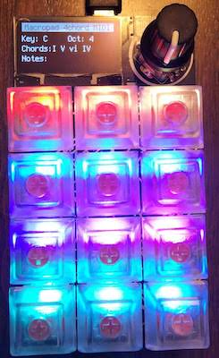
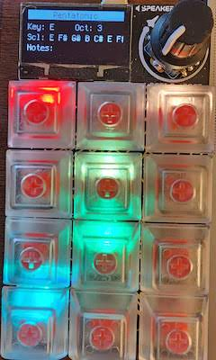
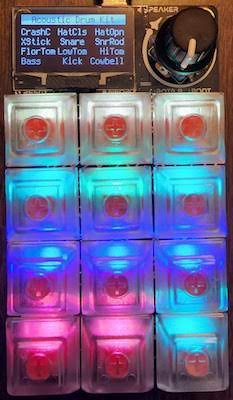
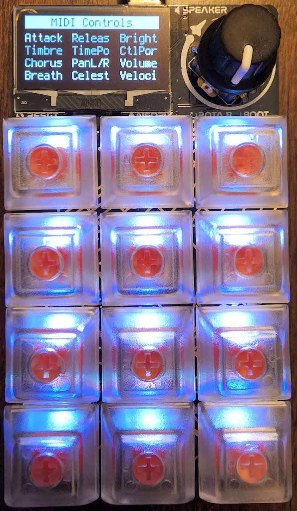

# Macropad 4chord MIDI

## Contents

* **[About the Macropad 4chord MIDI](#about)**
* **[Playing Harmonies, Melodies, and Rhythms](#playing)**
* **[Installing on an Adafruit Macropad](#installing)**
* **[Updating an Existing Installation](#updating)**
* **[How to configure progressions, drum kits, MIDI settings](#configuring)**
* **[Building & Testing This Project](#building)**

## About

> "All the greatest hits from the past forty years just use four chords. Same four chords for every song. It's dead simple to write a pop hit.""
 -- Benny, Axis of Awesome

A four-chord MIDI device that allows you to rapidly churn out catchy tunes.
Set your root key & chord progression, then off you go. Includes drum pads
so you can provide a backing beat to your tracks.

Huge thanks to so many who have inspired this idea, especially:
- [Sven Gregori](https://github.com/sgreg) and his
[4 Chord USB MIDI Keyboard](https://hackaday.io/project/26078-4chord-midi)
- [ArcAttach](https://youtu.be/d2OsF86fcKQ) and their
[StringTheory project](https://arcattack.com/stringtheory/)
- Paul David's [The Four Chord Song](https://youtu.be/6U8-Y7DEzOE) music theory video
- [iSongs' Take On Me with iOS' GarageBand](https://youtu.be/U3aiBukp_E4)
- Andrew Huang's [learn music theory in half an hour](https://youtu.be/rgaTLrZGlk0) video
- ...and of course [Axis of Awesome's Four Chord Song](https://youtu.be/5pidokakU4I)

## Playing

The Macropad 4chord MIDI is built to play simple chord progressions, follow scales to build
melodies, and act as a drum kit as a MIDI device. You can connect the Macropad to any studio 
recording software or DAW accepts MIDI devices, such as GarageBand or Abelton Live.

The 4chord MIDI has four different modes: the "harmony" mode that allows you
to select progressions and root keys to play chords, the "melody" mode that
highlights different scales you can play, the "rhythm" mode that
allows you to use the MacroPad as an acoustic drum / electric drum /
percussion pad, and a "MIDI controls" mode that lets you set MIDI command
controls (including note velocity). You can switch between each mode by
clicking on the rotary dial.

A demo of using the MacroPad 4chord MIDI with GarageBand is available at https://youtu.be/2-FtnHHVXCg

### Chord Keyboard

Once you power on the Macropad a default progression is restored, with the root
on middle C (I'm a assuming middle C is on the fourth octave). The root note
is at the top left, with the major (or minor) third and perfect fifth on the
middle and right keys. The key and octave can be changed by rotating the
encoder dial, going up or down the chromatic scale.

As you go down the keypad, the notes follow the four chord progression listed
on the screen. By default this is a I-V-vi-IV progression, so with the root
at C4 you will have G4, A5, and F4 as you go down the keypad. You can rotate
through some four chord progressions by pressing down on the encoder button
while rotating the dial.

Thanks to the RP2040, all the keys can be pressed simultaneously. You can
play the triad chords for each degree, or arpeggiate the chords however
you like. The list of notes currently being played are displayed on screen
if you want to check my math.

You can bend the current notes being played by rotating the dial while keys
are being held down. Rotating counter-clockwise will bend the pitch down,
rotating clockwise will bend the pitch up.

### Highlight Scales

Clicking once on the rotary dial after the Macropad boots loads the
"melody" keyboard. In this mode each of the 12 buttons on the Macropad
corresponds to a note on the chromatic scale, with the root note you
have selected in the top left. 

The buttons that are illuminated correspond to the scale selected while
in this mode. You can play as many notes as you wish simultaneously,
however only the highlighted notes are part of the selected scale.
To change to a different scale (pentatonic major, relative minor, 
blues major, etc.) press down on the encoder button and rotate the dial.
The name and first seven notes of the scale will be shown on the display.

Just as when playing chord progressions, you can bend the current notes 
being played by rotating the dial while keys are being held down. 
Rotating counter-clockwise will bend the pitch down, rotating clockwise 
will bend the pitch up.

### Drum Pads

If you click twice on the rotary dial after the Macropad boots, it will move
into the drum pad mode. Rotating the dial will allow you to select from
a number of drum or percussion presets where MIDI notes match an acoustic drum,
a rhythm composer (such as the classic TR-808), or percussion strikes.
Actual percussion sounds depend on the MIDI controller or DAW you are using,
so you may need to make some [configuration tweaks](#configuring)
with the MIDI mapping to match what instrument you want to use.

### MIDI Controls

Clicking three times after booting the Macropad will take you into the MIDI controls
mode, where you can adjust MIDI controls that are transferred to your DAW
when recording. This includes global settings (such as attack or release time)
as well as note settings (such as velocity).

Bear in mind that not all DAWs will register MIDI commands from devices in the
same way. Some DAWs register the commands so long as your device is connected,
others will not register any commands until you begin recording. If you find
that your DAW isn't picking up the values you set, start recording while the
"MIDI Controls" mode is showing on the Macropad, then single-click to return
to the chords mode immediately after. This will re-send all the MIDI commands
to your DAW.

## Installing

First make sure that your Macropad has the
[latest version of CircuitPython 8.x installed](https://circuitpython.org/board/adafruit_macropad_rp2040/).
See [https://learn.adafruit.com/adafruit-macropad-rp2040/circuitpython](https://learn.adafruit.com/adafruit-macropad-rp2040/circuitpython)
for instructions on how to update the Macropad to have the latest version of
CircuitPython.

When installing the Macropad 4chord for the first time, extract the latest
[MacroPad 4chord MIDI.zip](https://github.com/deckerego/Macropad_4chord_MIDI/releases/latest)
into a directory, then copy the contents of that extracted archive
into the CIRCUITPY drive that appears when you plug in your Macropad.
Ensure that the contents of the `lib/` subdirectory are also copied - these are
the precompiled Adafruit libraries that power the Macropad.

## Updating

After you first install this version of Macropad 4chord MIDI and reboot the Macropad,
the CIRCUITPY filesystem will be mounted as read-only. When mounting the device
as read-only, Windows and MacOS won't complain if you unplug or reboot the device
without unmounting it, making it more like a regular old HID device.

To update or edit the code on the device, or to modify the settings, you first
need to reboot the device with the CIRCUITPY drive mounted in read/write mode.
To do that, reboot the device using the boot switch on the left of the
Macropad, and then after releasing the button immediately hold down the
rotary encoder button. You should see the text "Mounting Read/Write" quickly
appear on the screen, and then the CIRCUITPY drive will mount in read/write mode.

## Configuring

The `settings.py` file has several settings you can tweak, including
MIDI note configurations, MIDI channel settings, and a list of the progressions 
you can scroll through. If you would like to add your own chord progressions or 
would like to keep a shorter list of possible keys, you can make those changes 
in the `settings.py` file within the CIRCUITPY drive. Just make sure to mount 
your Macropad in read/write mode (see [Updating](#updating)).

## Building

There is no big build process since the Python files are distributed in
.py form and are not compiled to Micropython. Just copy-and-paste.

### Packaging

The necessary Adafruit CircuitPython libraries are provided in the
releases package but not included in the Git repository for obvious reasons.
If you are installing from this repo directly, review
[lib/README.md](./lib/README.md) for details on how to add the
necessary libraries.

### Unit Testing

Unit testing can be run with:

    python3 -m unittest discover
